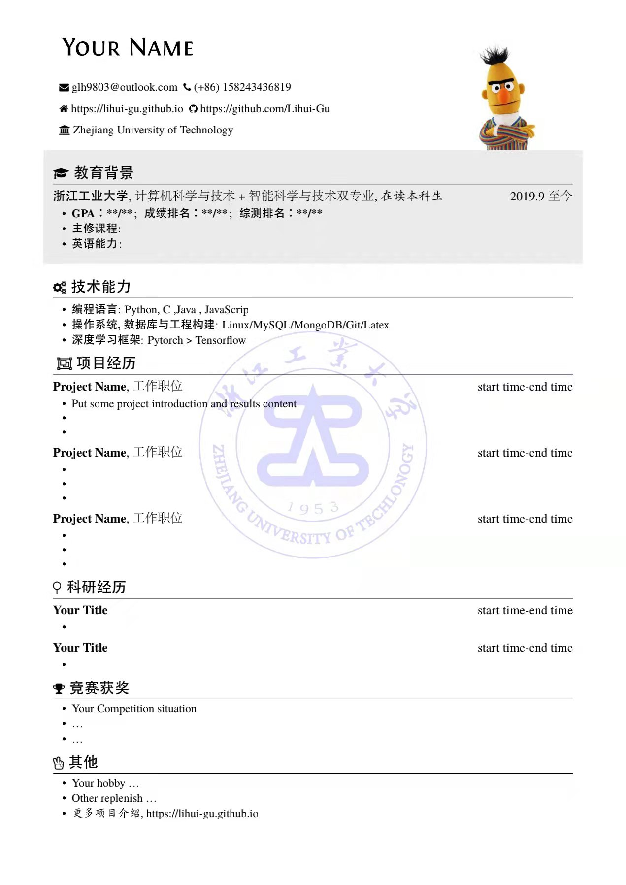

# 一个简洁而优雅的简历模板
一份简洁而优雅的简历通常能让人眼前一亮，留下好印象。本项目是个人简历 Latex 源码存放，同时包含效果图呈现，简历入口为 resume-zh_CN.tex， 参考于项目 [resume](https://github.com/billryan/resume/)，如果你对我的工作比较认可，期待你的fork和star。

## 项目说明

一个优雅的 \LaTeX\ 简历模板, 使用 \XeLaTeX\ 编译, 主要参考项目 [resume](https://github.com/billryan/resume/)，并在此基础上修改，增加了相关元素，并受下列项目启发：

- [billryan-resume](https://github.com/billryan/resume/tree/zh_CN)
- [插入照片](https://www.csdn.net/tags/MtTaIg0sNDI1MzQ0LWJsb2cO0O0O.html)
- [添加水印](https://github.com/PM-Hu/My_resume)
*注：由于使用到 `fontspec` 包，编译器需选择 XeLaTeX。*

## 改动
- 增加了个人证件照
- shade增加灰色背景突出
- 增加了背景水印图片，background
- 使用XeLaTeX，完善Adobefonts中文字体支持
- 支持 FontAwesome

### 效果输出



## 使用方法

### Latex使用
`.cls`是某一类型的文档，如简历，文章，报告等的模板，基础格式都已经设置好了，每次排版几乎只使用一次，使用方式：`\documentclass{}`；`.sty` 是用来控制某一特定格式，用来控制如字号，字体，标题等，每次排版可多次使用，使用方式：`\usepackage{}`。在`/image`中添加你的校徽和个人照片。
### xelatex
vscode的配置文件在`utils/json.txt`中给出，使用时左下角齿轮-命令面板-搜索首选项(json)，`settings.json`文件中的内容进行替换即可使用xelatex编译，完美运行。

### 表格使用介绍
整体的框架如下：
```
\usepackage{graphicx}%插入图片
\usepackage{tabularx,booktabs}%控制版面
\usepackage{float}%控制图片位置
\usepackage{setspace}% 调整行间距
\usepackage{multicol}%分栏
\usepackage{geometry}%设置页边距
\usepackage{fontawesome}%特殊符号,以\fa开头
\usepackage{multirow}%合并行
\usepackage{makecell}%合并行
\usepackage{array}%设置表格行距

\begin{document}
%正文内容
\end{document}
```
使用表格tabular插入图片
```
\renewcommand\arraystretch{1.5}
\begin{tabular}{p{13cm} p{4cm}}
\textbf{\name{Lihui Gu}} & \multirowcell{5}{\includegraphics[scale=0.3]{person.jpg}}\\
\faEnvelope \ glh9803@outlook.com  \  \faPhone \ (+86)\ 158243436819 & \\
\faHome \ https://lihui-gu.github.io & \\ 
\faGithub \ https://github.com/Lihui-Gu & \\
\faUniversity \ Zhejiang University of Technology & \\
\end{tabular}
```

### 宏

- `\name`: 姓名
- `\contactInfo`: 联系信息, 需要三项信息，分别是{邮箱}{手机号}{个人主页}
- `\basicContactInfo`: 简要的联系信息, 需要 项信息, 分别是{邮箱}{手机号}, 没有个人主页的用这个
- `\section`: 用于分节, 如教育背景, 实习/项目经历等
- `\subsection`: 用于小节标题, 无日期选项
- `\datedsubsection`: 用于小节标题, 简历中使用最广，第二项为时间区间，自动右对齐
- `\itemize`: 清单列表，简历中应用最广
- `\enumerate`: 枚举列表，数字标号

### FontAwesome
文件`fontawesome.pdf`中包含了各类图标的使用名称，可通过`ctrl+F`快速查找使用
例如`\faGithub`，代表Github图标。


## 写在最后
更多项目欢迎访问[我的主页](https://lihui-gu.github.io/)，如果你有更好的建议，可以通过邮箱告诉我。


